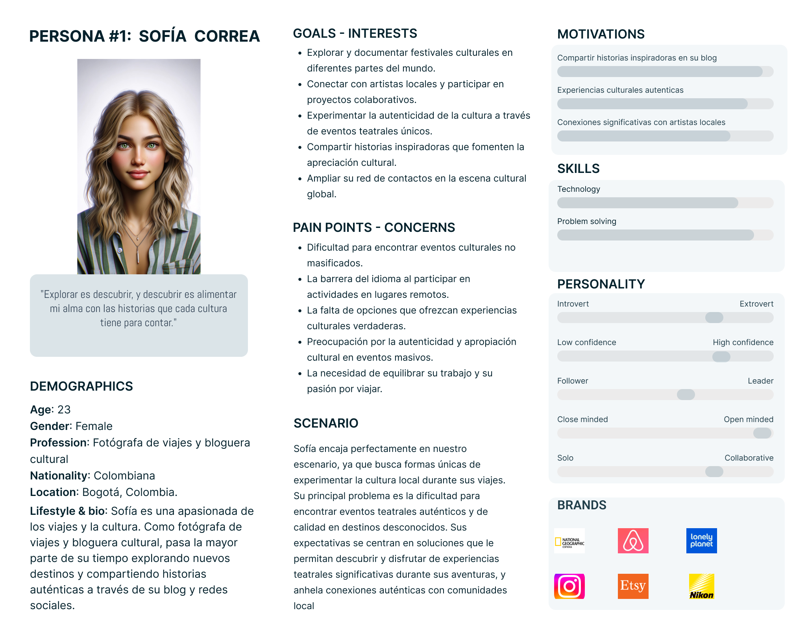
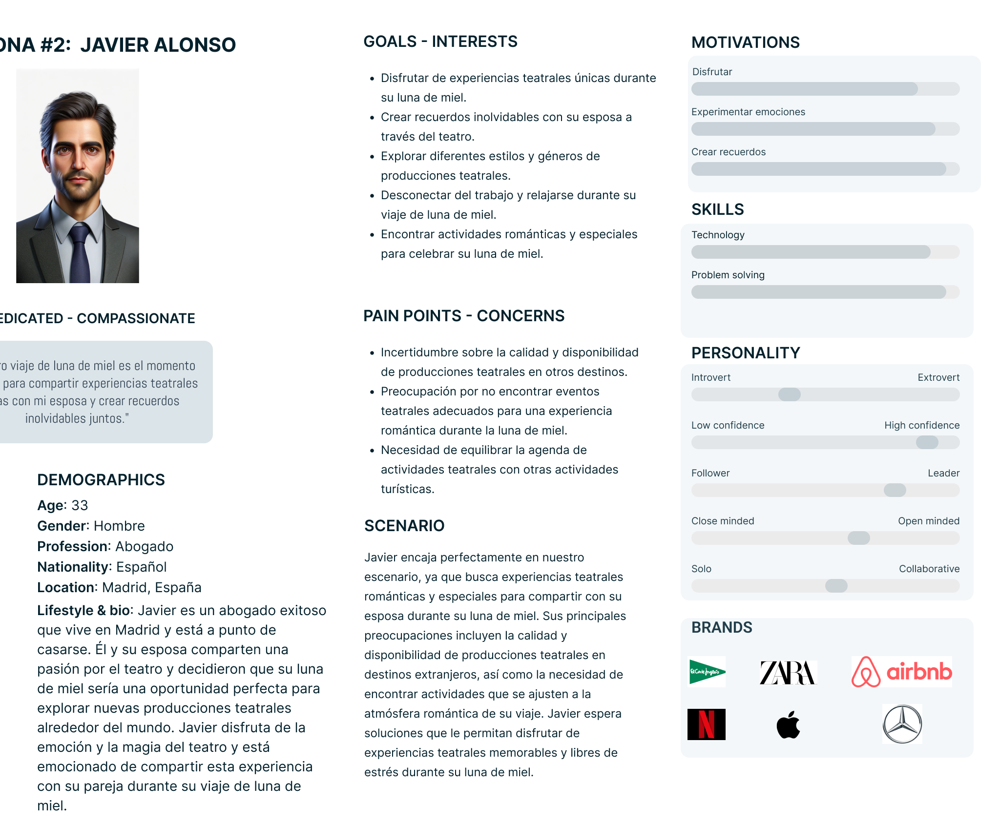
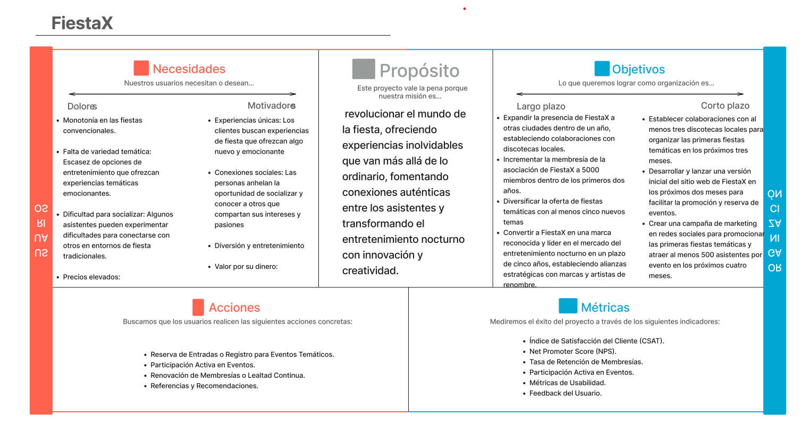
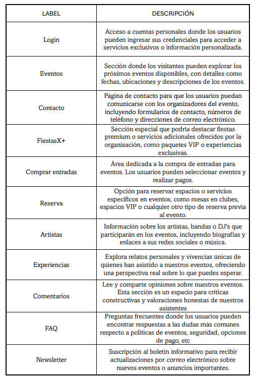
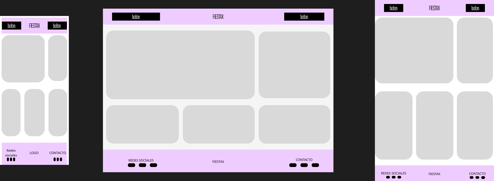
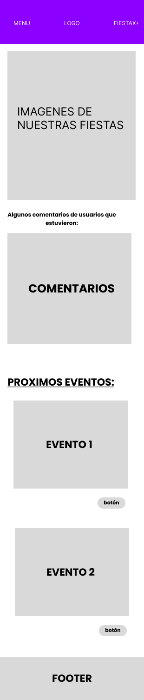

# DIU24
Prácticas Diseño Interfaces de Usuario 2023-24 (Tema: La Estupenda ) 

Grupo: DIU1_Mae-striaNocturna.  Curso: 2023/24 
Updated: 11/2/2024

Proyecto: 
FiestaX

Descripción: 
FiestaX es un proyecto diseñado para revolucionar el mundo de la fiesta, llevando al siguiente nivel las fiestas temáticas.

Logotipo: 
>>> Opcionalmente si diseña un logotipo para su producto en la práctica 3 pongalo aqui

Miembros
 * :bust_in_silhouette:   Zakaria Sahraoui El Ouahabi  - https://github.com/Zaakaria7    :octocat:     
 * :bust_in_silhouette:   Pablo Franco Maldonado  - https://github.com/PabloF5   :octocat:

----- 

# Proceso de Diseño 

## Paso 1. UX User & Desk Research & Analisis 

 **1.a User Reseach Plan**
-----

>>> Describe el plan de User Research (cómo se planteas)

El plan de User Research planteado se centra en mejorar una página web dedicada a promover la participación en obras de teatro y clases de teatro en Granada, dirigida a aficionados al teatro y personas interesadas en esta disciplina. El objetivo es obtener una comprensión profunda de la experiencia del usuario, identificar áreas de mejora, y asegurarse de que la plataforma cumpla con las expectativas del público objetivo. Este enfoque busca comprender las preferencias del público, evaluar la experiencia del usuario, y medir la efectividad de las estrategias de promoción. Se utilizarán métodos de investigación primaria como la etnografía, entrevistas con usuarios, investigación contextual, pruebas de usabilidad, y encuestas post-sesión para recopilar información cualitativa y cuantitativa. La investigación se centrará en temas de alto nivel relacionados con el contenido multimedia preferido por los usuarios, la influencia de este contenido en sus decisiones, y la percepción de la calidad visual y la autenticidad de las obras de teatro. Los participantes incluirán aficionados a innovaciones teatrales, estudiantes de teatro o actuación, y turistas o visitantes locales. Los hallazgos cualitativos y cuantitativos resultantes de la investigación guiarán la optimización de la página web, mejorando la oferta y fortaleciendo la conexión con la audiencia  

 1.b Competitive Analysis
-----

>>> Describe brevemente características de las aplicaciones que tienes asignadas, y por qué has elegido una de ellas 

En el análisis de competidores, se evaluaron tres aplicaciones basadas en varios criterios, incluyendo el modelo de negocio, cuestiones tecnológicas, funcionalidad y uso, usabilidad, y aspectos subjetivos como el diseño web y el valor percibido. A continuación, se describen brevemente estas aplicaciones:

Espacio La Estupenda:
Modelo de Negocio: Muy bueno, con altas puntuaciones en precio/subscripción, cantidad de opciones, y satisfacción de clientes.
Cuestiones Tecnológicas: Problemas significativos en carga de la web y navegación.
Usabilidad: Mejorable, especialmente en dispositivos móviles.
Aspectos Subjetivos: Aunque tiene un buen diseño web, el valor percibido no es el más alto.

EACT La Seducción:
Modelo de Negocio: Focalizado en cursos de teatro, con una buena oferta educativa pero limitada en otros aspectos.
Cuestiones Tecnológicas y Usabilidad: Considerables problemas tecnológicos y de usabilidad.
Aspectos Subjetivos: El diseño web y el valor percibido son bajos, lo que afecta la conversión de clientes.

La Bobina:
Modelo de Negocio: Destacado por su prestigio y la calidad de su oferta educativa y de contenido.
Cuestiones Tecnológicas: Mejores que los competidores, aunque con margen de mejora.
Usabilidad: Buena, con una experiencia de usuario satisfactoria en diferentes dispositivos.
Aspectos Subjetivos: Alto diseño web y valor percibido.

Hemos seleccionado "La Seducción" como competidor directo de "La Estupenda" dado que ambas operan como escuelas de teatro dentro del mismo contexto local, presentándose como alternativas inmediatas entre sí para la audiencia de la región. Por otro lado, "La Bobina" ha sido escogida por su reconocida excelencia a nivel nacional, destacándose como una de las instituciones líderes en la enseñanza teatral en España. Su amplia gama de cursos y contenidos ricos marcan un alto estándar en la calidad educativa y cultural en el ámbito del teatro.

 1.c Persona
-----

>>> Comenta brevemente porqué has seleccionado a esas personas y sube una captura de pantalla de su ficha

El primer perfil lo elegimos ya que en granada hay una gran cantidad de actividades disponibles para la gente que se considera aventurera o gente que le gusta el teatro. Este perfil esta hecho para esas personas sean o no de aquí, por eso en este perfil intentamos mezclar un poco estos dos perfiles, y pusimos que era extranjera ya que nos ayudaba a explicar algunos problemas que queríamos solucionar.

Para el segundo perfil elegimos turistas nacionales ya que granada tiene muchísimos y con uno de nuestros cambios intentamos sacar provecho de esta circunstancia. Este perfil viene con la idea de un tipo de teatro muy personal para el y su pareja basado en la vivencia de una gran experiencia más que en aprender de actuación.

 1.d User Journey Map
----
>>> Comenta brevemente porqué has escogido estas dos experiencias de usuario (y si consideras que son habituales)

Hemos elegido estas experiencias de usuario ya que nos van a ayudar a resolver algunos problemas o mejoras que vemos posibles, como las clases de teatro personalizadas que aporten experiencias únicas a los usuarios. No son habituales ya que para los habituales tenemos otras ideas para conseguir atraer a más personas a las clases y a las actuaciones, estas ideas se basan más en los perfiles locales.

 1.e Usability Review
----
>>>  Revisión de usabilidad: (toma los siguientes documentos de referncia y verifica puntos de verificación de  usabilidad
>>>> SE deben incluir claramente los siguientes elementos
>>> - Enlace al documento:  https://github.com/Mae-stria-Nocturna/DIU1.Mae-striaNocturna/blob/master/P1/Usability-review-template.pdf 
>>> - Valoración final (numérica): 6/10
>>> - Comentario sobre la valoración:Es una página web muy básica pero que las cosas que tiene están claras y se entienden sin gran dificultad. (60-120           caracteres). 

## Paso 2. UX Design  

 2.a Reframing / IDEACION: Feedback Capture Grid / EMpathy map 

(img/malla.png)
   
>>> ¿Que planteas como "propuesta de valor" para un nuevo diseño de aplicación para economia colaborativa ?
>>> Problema e hipótesis
>>>  Que planteas como "propuesta de valor" para un nuevo diseño de aplicación para economia colaborativa te
>>> (150-200 caracteres)

Plataforma intuitiva y escalable que facilita intercambios y conexiones personalizadas, ofreciendo recomendaciones inteligentes basadas en preferencias del usuario y experiencias locales, con un soporte ágil y seguro.

 2.b ScopeCanvas
FiestaX reinventa la celebración local, transformando eventos ordinarios en experiencias temáticas únicas. Nuestra plataforma conecta a los usuarios con fiestas exclusivas en momentos especiales, fomentando la diversidad y la innovación en cada encuentro.

 2.b User Flow (task) analysis 
-----

User Matrix: Es una técnica que organiza en una tabla las interacciones entre grupos de usuarios y las tareas que pueden realizar en la aplicación,
marcando con colores las tareas y perfiles más importantes. Por ejemplo, en FiestaX, ayudaría a diferenciar las necesidades de los organizadores de eventos y los asistentes.

Task Flow: Esta técnica muestra visualmente las tareas que los usuarios deben realizar para alcanzar sus objetivos mediante diagramas que indican secuencias y dependencias de acciones.
En FiestaX, podría ilustrar el proceso desde descubrir eventos hasta la participación en ellos.

 2.c IA: Sitemap + Labelling 

 2.d Wireframes
-----

>>> Plantear el  diseño del layout para Web/movil (organización y simulación ) 

## Paso 3. Mi UX-Case Study (diseño)

 3.a Moodboard
-----

>>> Plantear Diseño visual con una guía de estilos visual (moodboard) 
>>> Incluir Logotipo
>>> Si diseña un logotipo, explique la herramienta utilizada y la resolución empleada. ¿Puede usar esta imagen como cabecera de Twitter, por ejemplo, o necesita otra?

  3.b Landing Page
----

>>> Plantear Landing Page 

 3.c Guidelines
----

>>> Estudio de Guidelines y Patrones IU a usar 
>>> Tras documentarse, muestre las deciones tomadas sobre Patrones IU a usar para la fase siguiente de prototipado. 

  3.d Mockup
----

>>> Layout: Mockup / prototipo HTML  (que permita simular tareas con estilo de IU seleccionado)
Enlace: https://www.figma.com/proto/HLlWfFmZFIBRQrbpxl0pRr/LAYOUT-HI-FI?node-id=38-211&t=YLU3J0NxgLxwBMHf-1&scaling=scale-down&page-id=0%3A1&starting-point-node-id=38%3A211

 3.e ¿My UX-Case Study?
-----

>>> Publicar my Case Study en Github..
>>> Documente y resuma el diseño de su producto

## Paso 5. Exportación & evaluación con Eye Tracking 

Exportación a HTML/Flutter
-----

)  5.b Eye Tracking method 

>>> Indica cómo diseñas experimento y reclutas usuarios (uso de gazerecorder.com)  

Diseño del experimento 
----

>> Uso de imágenes (preferentemente) -> hay que esablecer una duración de visualización y  
>> fijar las áreas de interes (AoI) antes del diseño. Planificar qué tarea debe hacer el usuario (buscar, comprar...) 

  
>> cambiar img por tu diseño de experimento  

>> Recordar que gazerecorder es una versión de pruebas: usar sólo con 3 usuarios para generar mapa de calor (recordar que crédito > 0 para que funcione) 

Resultados y valoración 
-----

>> Cambiar por tus resultados
  

## Paso 4. Evaluación 

 4.a Caso asignado
----

>>> Breve descripción del caso asignado con enlace a  su repositorio Github

 4.b User Testing
----

>>> Seleccione 4 personas ficticias. Exprese las ideas de posibles situaciones conflictivas de esa persona en las propuestas evaluadas. Asigne dos a Caso A y 2 al caso B
 

| Usuarios | Sexo/Edad     | Ocupación   |  Exp.TIC    | Personalidad | Plataforma | TestA/B
| ------------- | -------- | ----------- | ----------- | -----------  | ---------- | ----
| User1's name  | H / 18   | Estudiante  | Media       | Introvertido | Web.       | A 
| User2's name  | H / 18   | Estudiante  | Media       | Timido       | Web        | A 
| User3's name  | M / 35   | Abogado     | Baja        | Emocional    | móvil      | B 
| User4's name  | H / 18   | Estudiante  | Media       | Racional     | Web        | B 

 4.c Cuestionario SUS
----

>>> Usaremos el **Cuestionario SUS** para valorar la satisfacción de cada usuario con el diseño (A/B) realizado. Para ello usamos la [hoja de cálculo](https://github.com/mgea/DIU19/blob/master/Cuestionario%20SUS%20DIU.xlsx) para calcular resultados sigiendo las pautas para usar la escala SUS e interpretar los resultados
http://usabilitygeek.com/how-to-use-the-system-usability-scale-sus-to-evaluate-the-usability-of-your-website/)
Para más información, consultar aquí sobre la [metodología SUS](https://cui.unige.ch/isi/icle-wiki/_media/ipm:test-suschapt.pdf)

>>> Adjuntar captura de imagen con los resultados + Valoración personal 

 4.d Usability Report
----

>> Añadir report de usabilidad para práctica B (la de los compañeros)

>>> Valoración personal 

5.) Conclusion de EVALUACION (A/B testing + usability report + eye tracking) 
----

>> recupera el usability report de tu práctica (que es el caso B de los asignados a otros grupos) 
>> con los resultados del A/B testing, de eye tracking y del usability report:
>>  comentad en 2-3 parrafos cual es la conclusion acerca de la realización de la práctica y su evaluación con esas técnicas y que habéis aprendido

## Conclusión final / Valoración de las prácticas

>>> (90-150 palabras) Opinión FINAL del proceso de desarrollo de diseño siguiendo metodología UX y valoración (positiva /negativa) de los resultados obtenidos  

